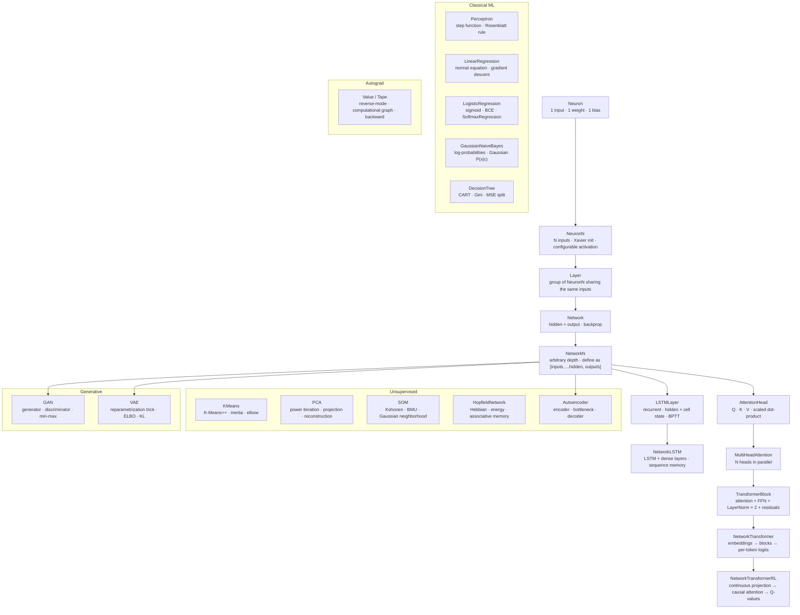

[](https://www.npmjs.com/package/@dniskav/neuron)
[](LICENSE)

A minimal, dependency-free neural network library built from scratch in TypeScript. Designed for learning and experimentation — every line of math is readable.

Each class is a building block for the next: from a single neuron to a full Transformer with causal attention. Includes classical ML, unsupervised learning, generative models, embeddings, and autograd — all in pure TypeScript, zero dependencies.



## What's inside

### Neural network building blocks

| Export | Description |
|--------|-------------|
| `Neuron` | Single-input neuron. The simplest possible unit: one weight, one bias. |
| `NeuronN` | N-input neuron with Xavier initialization and configurable activation. |
| `Layer` | A group of `NeuronN` neurons that share the same inputs. |
| `Network` | Two-layer network (hidden + output) with backpropagation. |
| `NetworkN` | Deep network of arbitrary depth. Define your architecture as `[inputs, ...hidden, outputs]`. |
| `LSTMLayer` | Recurrent layer with persistent hidden and cell state. Learns sequences via BPTT. |
| `NetworkLSTM` | Wraps an `LSTMLayer` + dense layers. Maintains memory across steps within an episode. |
| `GRULayer` | Gated Recurrent Unit — lighter alternative to LSTM, two gates instead of three. |
| `NetworkTransformer` | Full token-classification Transformer: embeddings → N blocks → per-token logits. |
| `NetworkTransformerRL` | Transformer for RL agents: continuous input projection → causal attention → Q-values. |
| `TransformerBlock` | One Transformer block: multi-head attention + FFN + LayerNorm × 2 with residuals. |
| `MultiHeadAttention` | N parallel attention heads concatenated and projected to `d_model`. |
| `AttentionHead` | Single scaled dot-product self-attention head (Q / K / V projections + backprop). |

### Layers & components

| Export | Description |
|--------|-------------|
| `Conv1D` | 1D convolution over sequences. Multi-channel, configurable stride and padding. |
| `Conv2D` | 2D convolution for images. Kernels `[filters][kH][kW][C]`, full forward + backward. |
| `MaxPool2D` | Max pooling 2D. Stores position mask for exact gradient routing in backprop. |
| `Flatten` | Converts `[H][W][C]` tensors to flat vectors. Bridges Conv layers to dense layers. |
| `RNN` | Vanilla RNN with BPTT. Explicitly shows where and why gradients vanish. |
| `Seq2Seq` | Encoder + Decoder LSTMs with context vector transfer. Teacher forcing in training. |
| `CausalConv1D` | Causal dilated 1D convolution. One building block of a TCN. |
| `TCN` | Temporal Convolutional Network. Stacks causal dilated convolutions for sequences without recurrence. |
| `LayerNorm` | Layer normalization with learnable γ / β per feature. |
| `BatchNorm` | Batch normalization with running mean/variance for inference. |
| `Dropout` | Inverted dropout for regularization. Active only during training. |
| `WeightMatrix` | 2D weight matrix with per-scalar Adam optimizers and optional gradient clipping. |
| `BiasVector` | 1D bias vector with per-scalar Adam optimizers. |
| `EmbeddingMatrix` | Lookup-table embedding matrix with SGD updates. |

### Classical ML

| Export | Description |
|--------|-------------|
| `Perceptron` | The historical Rosenblatt perceptron (1957). Step function, linear rule. Shows why XOR is impossible. |
| `LinearRegression` | Closed-form normal equation `(XᵀX)⁻¹Xᵀy` + gradient descent mode. Pure array arithmetic. |
| `LogisticRegression` | Sigmoid + binary cross-entropy, no hidden layers. The boundary between classical ML and neural nets. |
| `SoftmaxRegression` | Multinomial logistic regression. Log-sum-exp trick for numerical stability. |
| `GaussianNaiveBayes` | `P(c|x) ∝ P(c)·∏P(xᵢ|c)` in log-space. Zero gradient descent — pure Bayes. |
| `DecisionTree` | CART with Gini impurity (classification) or variance (regression). Fully recursive. |

### Unsupervised learning

| Export | Description |
|--------|-------------|
| `KMeans` | K-Means++ initialization + Lloyd's algorithm. `inertia()` for the elbow method. |
| `PCA` | Principal Component Analysis via power iteration + Hotelling deflation. Projects, reconstructs, explains variance. |
| `SOM` | Self-Organizing Map (Kohonen). BMU search, Gaussian neighborhood, topology preservation. |
| `HopfieldNetwork` | Associative memory. Hebbian storage, energy function, async recall. Capacity ~0.138·N. |
| `Autoencoder` | Encoder + bottleneck + decoder using two `NetworkN` instances. Learns compressed representations. |

### Generative models

| Export | Description |
|--------|-------------|
| `GAN` | Generator vs Discriminator min-max game. Documents Nash equilibrium and mode collapse. |
| `VAE` | Variational Autoencoder. Reparametrization trick, ELBO = reconstruction + KL divergence. |

### Automatic differentiation

| Export | Description |
|--------|-------------|
| `Value` | Scalar autograd node. Builds a computational graph and propagates gradients with `.backward()`. Inspired by micrograd. |

### Embeddings

| Export | Description |
|--------|-------------|
| `Word2Vec` | Learns word embeddings via Skip-gram or CBOW. Full-softmax, cosine similarity, analogies (`king - man + woman ≈ queen`). |
| `TSNE` | t-SNE dimensionality reduction. Binary-search perplexity, Student-t kernel, KL gradient, early exaggeration. |
| `PositionalEncoding` | Sinusoidal positional encoding (Vaswani et al.). Static — no parameters, generalizes to unseen lengths. |
| `LearnedPositionalEncoding` | Trainable positional encoding. Xavier-initialized, learnable up to a fixed `maxSeqLen`. |
| `ContrastiveLearning` | SimCLR-style self-supervised learning. NT-Xent loss, encoder + projection head, temperature τ. |
| `Augmenter` | Data augmentation helpers for contrastive pairs: Gaussian noise, feature dropout, `makePair()`. |

### Activations & math

| Export | Description |
|--------|-------------|
| `sigmoid` `relu` `tanh` `linear` `leakyRelu` `elu` | Built-in activation functions with `fn` and `dfn` (derivative from output). |
| `makeLeakyRelu(α)` `makeElu(α)` | Parametric variants. |
| `matMul` `transpose` `softmax` `softmaxBackward` | Matrix math utilities. |

### Optimizers

| Export | Description |
|--------|-------------|
| `SGD` | Vanilla stochastic gradient descent. Stateless. |
| `Momentum` | Accumulates velocity in the gradient direction. |
| `Adam` | Adaptive moment estimation. Per-parameter first and second moments with bias correction. |
| `ClipOptimizer` | Wraps any optimizer with gradient clipping. |
| `ClippedOptimizerFactory` | Factory wrapper that clips all created optimizers. |
| `defaultOptimizer` | Default factory (`() => new SGD()`). Shared fallback across all classes. |

### Loss functions

| Export | Description |
|--------|-------------|
| `mse` `crossEntropy` | Scalar loss functions for evaluation and logging. |
| `mseDelta` `crossEntropyDelta` `crossEntropyDeltaRaw` | Output-layer delta functions for `trainWithDeltas`. |

### Metrics & evaluation

| Export | Description |
|--------|-------------|
| `confusionMatrix` | Returns `number[][]` confusion matrix. |
| `accuracy` `precision` `recall` `f1Score` | Standard classification metrics. |
| `rocCurve` `auc` | ROC curve points and area under the curve (trapezoidal rule). |
| `mae` `rmse` `r2Score` | Regression metrics. |
| `perplexity` | `exp(mean cross-entropy)` — natural metric for language models. |
| `printConfusionMatrix` `classificationReport` | Console-formatted output tables. |

### Training utilities

| Export | Description |
|--------|-------------|
| `Trainer` | Training loop with epochs, batches, metrics, and callbacks. |
| `DataLoader` | Dataset wrapper with shuffling and validation split. |
| `LRScheduler` | Learning rate schedules (step, exponential, cosine). |
| `EarlyStopping` | Stops training when a metric stalls. Configurable patience, mode, and best-weight restore. |
| `LossPlotter` | Renders a loss curve as ASCII art in the terminal. |
| `WeightInspector` | Per-layer weight statistics (mean, std, dead weights). Detects dead ReLUs. |
| `DataAugmentation` | Noise, jitter, normalization, z-score, shuffle, train/val/test split. |
| `ModelSaver` | Universal serialization via flat `getWeights()` / `setWeights()`. |

## Install

```bash
npm install @dniskav/neuron
```

## Usage

### Single neuron — learn a threshold

```ts
import { Neuron } from "@dniskav/neuron";

const neuron = new Neuron();

for (let epoch = 0; epoch < 1000; epoch++) {
  neuron.train(20, 1, 0.1); // adult
  neuron.train(15, 0, 0.1); // minor
}

console.log(neuron.predict(17)); // ~0.1
console.log(neuron.predict(25)); // ~0.9
```

### NetworkN — deep network with custom architecture

```ts
import { NetworkN, relu, sigmoid, Adam } from "@dniskav/neuron";

const net = new NetworkN([3, 64, 32, 1], {
  activations: [relu, relu, sigmoid],
  optimizer: () => new Adam(),
});

net.train([0.5, 0.3, 0.8], [1], 0.001);
const [out] = net.predict([0.5, 0.3, 0.8]);
```

### Historical Perceptron — step function, no hidden layers

```ts
import { Perceptron } from "@dniskav/neuron";

const p = new Perceptron(2);

// Learns AND gate (linearly separable)
const data = [[0,0,0],[0,1,0],[1,0,0],[1,1,1]];
for (let e = 0; e < 100; e++)
  for (const [a, b, t] of data) p.train([a, b], t, 0.1);

console.log(p.predict([1, 1])); // 1
console.log(p.predict([0, 1])); // 0
// XOR cannot be learned — not linearly separable
```

### Linear Regression — normal equation

```ts
import { LinearRegression } from "@dniskav/neuron";

const model = new LinearRegression();

// Exact closed-form solution in one call
model.fitNormal(
  [[1], [2], [3], [4]],  // X
  [2, 4, 6, 8]           // y = 2x
);

console.log(model.predict([5]));   // ~10
console.log(model.getCoefficients()); // { weights: [2], bias: ~0 }
```

### Logistic Regression — sigmoid + BCE

```ts
import { LogisticRegression } from "@dniskav/neuron";

const clf = new LogisticRegression(2);
const lossHistory = clf.train(
  [[0,0],[1,1],[1,0],[0,1]],
  [0, 1, 1, 0],
  0.1, 500
);

console.log(clf.classify([0.9, 0.9])); // 1
console.log(clf.classify([0.1, 0.1])); // 0
```

### Gaussian Naive Bayes — zero gradient descent

```ts
import { GaussianNaiveBayes } from "@dniskav/neuron";

const nb = new GaussianNaiveBayes();
nb.fit(
  [[1.2, 0.5], [1.4, 0.7], [5.0, 4.5], [5.2, 4.8]],
  [0, 0, 1, 1]
);

console.log(nb.predict([1.3, 0.6])); // 0
console.log(nb.predict([5.1, 4.6])); // 1
```

### Decision Tree — Gini split

```ts
import { DecisionTree } from "@dniskav/neuron";

const tree = new DecisionTree({ maxDepth: 4, task: 'classification' });
tree.fit(X_train, y_train);
const predictions = tree.predictBatch(X_test);
```

### K-Means — unsupervised clustering

```ts
import { KMeans } from "@dniskav/neuron";

const km = new KMeans(3); // 3 clusters
km.fit(points);

const cluster = km.predict([1.2, 0.5]); // index 0, 1 or 2
console.log(km.inertia(points));        // lower = better fit
```

### PCA — dimensionality reduction

```ts
import { PCA } from "@dniskav/neuron";

const pca = new PCA(2); // keep top 2 components
pca.fit(X);             // 100 samples × 10 features

const Z = pca.transform(X);       // 100 × 2
const X2 = pca.inverseTransform(Z); // reconstructed 100 × 10

console.log(pca.explainedVarianceRatio()); // [0.72, 0.15, ...]
```

### Self-Organizing Map

```ts
import { SOM } from "@dniskav/neuron";

const som = new SOM(10, 10, 3); // 10×10 grid, 3-dimensional inputs (RGB)
som.train(colors, 500);

const [row, col] = som.getBMU([255, 0, 0]); // find best matching unit for red
console.log(som.quantizationError(colors));
```

### Hopfield Network — associative memory

```ts
import { HopfieldNetwork } from "@dniskav/neuron";

const net = new HopfieldNetwork(64); // 64 binary neurons

// Store two 64-bit patterns
net.store(HopfieldNetwork.binarize(pattern1)); // converts 0/1 → -1/+1
net.store(HopfieldNetwork.binarize(pattern2));

// Recall from noisy input
const recovered = net.recall(HopfieldNetwork.binarize(noisyPattern1));
console.log(net.energy(recovered)); // local minimum = stored memory
```

### Autoencoder — learn compressed representations

```ts
import { Autoencoder } from "@dniskav/neuron";

// 784 → [128, 64] → 16 (latent) → [64, 128] → 784
const ae = new Autoencoder(784, [128, 64], 16, [64, 128]);

for (let e = 0; e < 1000; e++)
  for (const x of images)
    ae.train(x, 0.001);

const latent       = ae.encode(image);       // compressed: 16 values
const reconstructed = ae.reconstruct(image); // decoded back: 784 values
```

### GAN — generative adversarial training

```ts
import { GAN } from "@dniskav/neuron";

const gan = new GAN(
  16,          // latentDim
  [32, 64],    // generator hidden layers
  8,           // outputDim (size of generated samples)
  [64, 32],    // discriminator hidden layers
);

for (let step = 0; step < 10000; step++) {
  const { dLoss, gLoss } = gan.trainStep(realBatch, 0.0002);
  if (step % 500 === 0) console.log(`D: ${dLoss.toFixed(3)}  G: ${gLoss.toFixed(3)}`);
}

const fake = gan.generate(); // new synthetic sample
```

### VAE — variational autoencoder

```ts
import { VAE } from "@dniskav/neuron";

const vae = new VAE(784, [256, 128], 32, [128, 256]);

for (const x of dataset) {
  const { totalLoss, reconLoss, klLoss } = vae.train(x, 0.001);
}

// Sample from latent space
const generated = vae.generate();          // random sample
const { mu, logVar } = vae.encode(image);  // encode → distribution params
const z = vae.reparametrize(mu, logVar);   // sample z ~ N(μ, σ²)
```

### Word2Vec — aprende embeddings de palabras

```ts
import { Word2Vec } from "@dniskav/neuron";

const w2v = new Word2Vec(64, { model: 'skipgram', windowSize: 2 });

const corpus = [
  ["the", "king", "rules", "the", "kingdom"],
  ["the", "queen", "rules", "the", "land"],
  ["man", "and", "woman", "are", "human"],
];

w2v.buildVocab(corpus);
w2v.train(corpus, 0.05, 200);

console.log(w2v.similarity("king", "queen")); // high
console.log(w2v.mostSimilar("king", 3));
// [{ word: 'queen', score: 0.91 }, ...]

// Vector arithmetic: king - man + woman ≈ queen
console.log(w2v.analogy("king", "man", "woman", 1));
// [{ word: 'queen', score: 0.87 }]
```

### t-SNE — visualiza embeddings en 2D

```ts
import { TSNE } from "@dniskav/neuron";

// Reduce 128-dim embeddings → 2D for plotting
const tsne = new TSNE({ perplexity: 30, nIter: 1000, seed: 42 });
const points2D = tsne.fitTransform(embeddings128D); // [n][2]

console.log(tsne.kl()); // KL divergence — lower is better
// Plot points2D with any charting library
```

### PositionalEncoding — orden sin parámetros

```ts
import { PositionalEncoding, LearnedPositionalEncoding } from "@dniskav/neuron";

// Sinusoidal — deterministic, no training needed
const pe = PositionalEncoding.encodeSequence(512, 128); // [512][128]
const withPos = PositionalEncoding.apply(tokenEmbeddings); // add PE to embeddings

// Learned — trainable, fixed maxSeqLen
const lpe = new LearnedPositionalEncoding(512, 128);
const withLearnedPos = lpe.apply(tokenEmbeddings);
lpe.update(gradients, 0.001); // update during backprop
```

### ContrastiveLearning — representaciones sin etiquetas

```ts
import { ContrastiveLearning, Augmenter } from "@dniskav/neuron";

// Encoder: 128 → [256, 128] → 64 latent, projection head: 64 → 32
const cl = new ContrastiveLearning(128, [256, 128], 64, { temperature: 0.5 });

// Create positive pairs from unlabeled data (two augmented views per sample)
const pairs = unlabeledData.map(x => Augmenter.makePair(x));

for (let step = 0; step < 1000; step++) {
  const loss = cl.trainStep(pairs, 0.001);
  if (step % 100 === 0) console.log(`step ${step}: ${loss.toFixed(4)}`);
}

// Use encoder for downstream tasks (classification, clustering, etc.)
const representation = cl.encode(newSample); // 64-dim vector
```

### Value / Tape — automatic differentiation

```ts
import { Value } from "@dniskav/neuron";

// Build a computation graph
const x = new Value(2.0);
const w = new Value(-3.0);
const b = new Value(6.7);
const n = x.mul(w).add(b);         // n = x*w + b
const o = n.tanh();                  // o = tanh(n)

// Backward pass — fills .grad for every node
o.backward();

console.log(x.grad); // ∂o/∂x
console.log(w.grad); // ∂o/∂w
console.log(b.grad); // ∂o/∂b
```

### Conv2D + MaxPool2D + Flatten — CNN pipeline

```ts
import { Conv2D, MaxPool2D, Flatten, NetworkN, relu, sigmoid } from "@dniskav/neuron";

const conv    = new Conv2D(28, 28, 1, 3, 8);  // 28×28×1 → 26×26×8
const pool    = new MaxPool2D(2);              // 26×26×8 → 13×13×8
const flatten = new Flatten();
const dense   = new NetworkN([13*13*8, 64, 10]);

// Forward
const featureMaps = conv.forward(image);       // [H][W][C]
const pooled      = pool.forward(featureMaps);
const flat        = flatten.forward(pooled);   // 1352 values
const logits      = dense.predict(flat);
```

### RNN — vanilla recurrent network

```ts
import { RNN } from "@dniskav/neuron";

// 1 input → 16 hidden → 1 output, over a sequence
const rnn = new RNN(1, 16, 1);

const sequence = [[0.1], [0.3], [0.7], [0.9]]; // 4 timesteps
const { outputs, hiddens } = rnn.forward(sequence);

// BPTT backward — returns MSE loss
const targets = [[0.2], [0.5], [0.8], [1.0]];
const loss = rnn.backward(sequence, targets, 0.01);
```

### TCN — Temporal Convolutional Network

```ts
import { TCN } from "@dniskav/neuron";

// 3 input channels → 32 channels × 4 levels → 1 output
// Receptive field = (3-1)·(2⁴-1)+1 = 30 timesteps
const tcn = new TCN(3, 32, 3, 4, 1);

const sequence = Array.from({ length: 50 }, () => [Math.random(), Math.random(), Math.random()]);
const outputs  = tcn.forward(sequence); // [50][1]
```

### NetworkLSTM — recurrent memory

```ts
import { NetworkLSTM } from "@dniskav/neuron";

const net = new NetworkLSTM(1, 8, [4, 1]);

for (let epoch = 0; epoch < 300; epoch++) {
  net.resetState();
  for (let step = 0; step < 6; step++) net.predict([1]);
  net.train([[0],[0],[0],[1],[1],[1]], 0.05);
}
```

### Metrics — evaluate your model

```ts
import { accuracy, f1Score, confusionMatrix, printConfusionMatrix, auc, classificationReport } from "@dniskav/neuron";

const yTrue = [0, 1, 1, 0, 1];
const yPred = [0, 1, 0, 0, 1];

console.log(accuracy(yTrue, yPred));          // 0.8
console.log(f1Score(yTrue, yPred));           // 0.8

const cm = confusionMatrix(yTrue, yPred);
printConfusionMatrix(cm, ['neg', 'pos']);

// AUC-ROC
const scores = [0.1, 0.9, 0.4, 0.2, 0.8];
console.log(auc(yTrue, scores));              // ~0.9

classificationReport(yTrue, yPred, ['neg', 'pos']);
```

### EarlyStopping

```ts
import { EarlyStopping } from "@dniskav/neuron";

const stopper = new EarlyStopping({ patience: 10, minDelta: 1e-4, mode: 'min' });

for (let epoch = 0; epoch < 1000; epoch++) {
  const valLoss = trainEpoch();
  if (stopper.update(valLoss, epoch)) {
    console.log(`Stopped at epoch ${epoch}`);
    break;
  }
}
```

### LossPlotter — ASCII loss curve

```ts
import { LossPlotter } from "@dniskav/neuron";

const plotter = new LossPlotter({ width: 60, height: 12, title: 'Training Loss' });

for (let e = 0; e < 500; e++) {
  const loss = trainStep();
  plotter.add(loss, e);
}

plotter.print();
// Training Loss
// ┌────────────────────────────────────────────────────────────┐
// │ 2.31 ·
// │      · ·
// │          · · ·
// │                · · · · · · ·
// │ 0.02                        · · · · · · · · · · · · · · ·
// └────────────────────────────────────────────────────────────┘
//   0                          250                         499
```

### DataAugmentation

```ts
import { DataAugmentation } from "@dniskav/neuron";

// Split dataset
const { trainX, trainY, valX, valY } = DataAugmentation.split(X, y, 0.8, 0.1);

// Normalize (fit on train, apply to all)
const { normalized: normTrain, min, max } = DataAugmentation.normalize(trainX);
const normVal = valX.map(x => DataAugmentation.normalizePoint(x, min, max));

// Augment training set (×3 copies with Gaussian noise)
const { X: augX, y: augY } = DataAugmentation.augmentBatch(normTrain, trainY, 3, 0.02);
```

### WeightInspector — diagnose your network

```ts
import { NetworkN, WeightInspector, relu } from "@dniskav/neuron";

const net = new NetworkN([784, 256, 128, 10], { activations: [relu, relu, relu] });
// ... train ...

WeightInspector.print(net);
// Layer 0:  mean=0.001  std=0.056  min=-0.21  max=0.19  dead=0   params=200960
// Layer 1:  mean=0.000  std=0.079  min=-0.31  max=0.28  dead=3   params=32896
// Layer 2:  mean=-0.001 std=0.091  min=-0.28  max=0.32  dead=0   params=1290
```

## How it works

Each class applies an **activation function** to the weighted sum of inputs and uses **gradient descent** to update weights:

```
weight += lr × delta × input
bias   += lr × delta
```

`NetworkN` implements full **backpropagation** across all layers, propagating deltas from the output back to the first layer using the chain rule. `NeuronN` uses **Xavier initialization** — weights start in `[-√(1/n), +√(1/n)]`.

When an **optimizer** is used (e.g., Adam), the raw gradient is passed to the optimizer instead of being applied directly. Each weight maintains its own optimizer state.

The `Value` class implements **reverse-mode automatic differentiation**: every operation records its inputs and a backward function. Calling `.backward()` on the output node performs a topological sort and propagates `∂L/∂w` through the entire graph.

## Build

```bash
npm run build   # outputs CJS + ESM + type declarations to dist/
npm run dev     # watch mode
npm test        # run test suite
```

## For AI agents

If you are an AI agent or LLM working with this codebase, read [AGENTS.md](AGENTS.md) first. It contains the full class hierarchy, design constraints, and what this library does not do.

## Changelog

### v0.3.1
- **New — Embeddings:** `Word2Vec` (Skip-gram + CBOW, full-softmax, cosine similarity, analogies), `TSNE` (binary-search perplexity, Student-t kernel, KL gradient, early exaggeration, seeded PRNG), `PositionalEncoding` (sinusoidal, Vaswani et al.), `LearnedPositionalEncoding` (trainable), `ContrastiveLearning` (NT-Xent, SimCLR encoder + projection head), `Augmenter` (noise, feature dropout, `makePair`)

### v0.3.0
- **New — Classical ML:** `Perceptron`, `LinearRegression` (normal equation + GD), `LogisticRegression`, `SoftmaxRegression`, `GaussianNaiveBayes`, `DecisionTree` (CART, Gini/MSE)
- **New — Unsupervised:** `KMeans` (K-Means++ init), `PCA` (power iteration + Hotelling deflation), `SOM` (Kohonen map), `HopfieldNetwork` (Hebbian storage + energy), `Autoencoder`
- **New — Deep Learning:** `Conv2D` (full forward/backward), `MaxPool2D` (position mask for exact backprop), `Flatten`, `RNN` (BPTT, documents vanishing gradient), `Seq2Seq` (encoder-decoder LSTM), `CausalConv1D`, `TCN` (dilated temporal convolutions)
- **New — Generative:** `GAN` (min-max game, Box-Muller sampling), `VAE` (reparametrization trick, ELBO = MSE + KL)
- **New — Autograd:** `Value` / `Tape` — scalar reverse-mode AD with topological backprop (micrograd-style)
- **New — Metrics:** `confusionMatrix`, `accuracy`, `precision`, `recall`, `f1Score`, `rocCurve`, `auc`, `mae`, `rmse`, `r2Score`, `perplexity`, `printConfusionMatrix`, `classificationReport`
- **New — Utilities:** `EarlyStopping` (patience + best-weight restore), `LossPlotter` (ASCII terminal curve), `WeightInspector` (per-layer stats, dead ReLU detection), `DataAugmentation` (noise, normalize, z-score, shuffle, split)

### v0.2.7
- **Docs:** Added architecture diagram to README

### v0.2.6
- **Fix:** `Network.predict` now returns `number[]` (consistent with all other network classes)
- **Fix:** `Network.train` now uses the configured optimizer and `activation.dfn()`
- **Fix:** `LayerNorm.backwardOne` correctly uses pre-update γ
- **Fix:** LSTM and GRU gate initialization corrected to Xavier fan-in+out
- **New:** `BiasVector` — 1D counterpart to `WeightMatrix`
- **New:** `defaultOptimizer` — shared default factory
- **Refactor:** `NetworkN` extracts `_forwardAll()` and `_backpropLayers()`

### v0.2.5
- Unified optimizer factories for `LSTMLayer`, `GRULayer`, `Conv1D`
- `NetworkN`: residual connections and dropout
- `Conv1D`: multi-channel input
- `Trainer`: weight decay, early stopping, classification metrics
- `DataLoader`: validation split
- `ModelSaver`: universal serialization

## License

MIT
